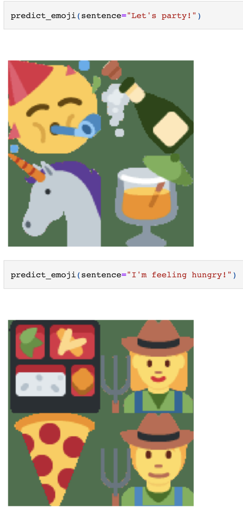

# Emoji Predictor

Trying to predict emoji's based on a sentence, the unsupervised way.

## CLIP

> Note: I used a Sagemaker Notebook. On Sagemaker Studio the clip client could not find the clip server. No idea what was going wrong.

Clip was really easy to work with thanks to jina.ai's clip as a service: https://github.com/jina-ai/clip-as-service 

1) You download the CLIP model
2) Embed the emoji's in the CLIP model
3) You send a sentence and CLIP predicts emoji's.

The results are not bad because we did not fine tune with any training data.

## Procedure

###  Pretrained

- get dataset from either;
    - huggingface: https://huggingface.co/datasets/AlekseyDorkin/extended_tweet_emojis/tree/main
    - github: https://github.com/Defcon27/Emoji-Prediction-using-Deep-Learning

- add the emoji's from this dataset and embed in CLIP
- can we compare the embedding of the image in CLIP to the values have here: https://github.com/abushoeb/EmoTag/blob/master/data/EmoTag1200-scores.csv ?
- run the test dataset against CLIP, what performance do we get? look also for precision

###  Finetune

- example:
    - https://www.kaggle.com/code/shahnaivedh/emoji
    - https://www.kaggle.com/code/satwiksrivastava/emoji-prediction/data
    - https://github.com/Defcon27/Emoji-Prediction-using-Deep-Learning

-  article: 
    - https://huggingface.co/blog/fine-tune-clip-rsicd
    - https://discuss.huggingface.co/t/clipmodel-finetuning/13388/8
    - https://huggingface.co/blog/fine-tune-clip-rsicd